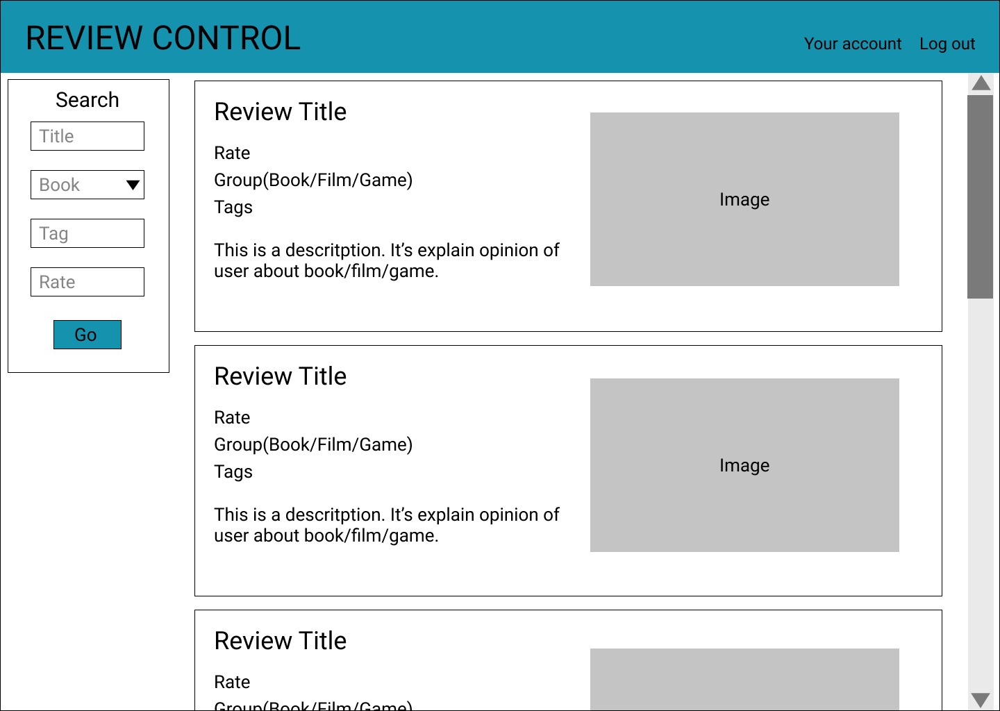

Климович Ирина 953504 

# Description 
This is a review management app. 
Share your impressions about a book, movie or game. See other people's reviews. Find a new perspective on your favorite topics. 

# Mock up
header,  
article for each review, 
aside for search panel,  
input for Title, Tag, Rate,  
select for Group, 
button for Go, Your account, Log out, 
img for images,  
h5 for Review Title,  
label for Rate, group, tags, 
pre for Description,  
 

# Project functions 
1) Create, edit, delete user review 
2) Search and filter reviews by title/tags/group/rate 
3) Like review 
4) Comment review 
5) Rate review 
6) List most popular reviews 

# Data models
### User
id 
name 
login 
password 
### Review
id 
Title 
Rate 
Group 
Tags 
Description 
Images 
Creator 
### Tag
id 
Name 
### Image
id 
ImagePath 